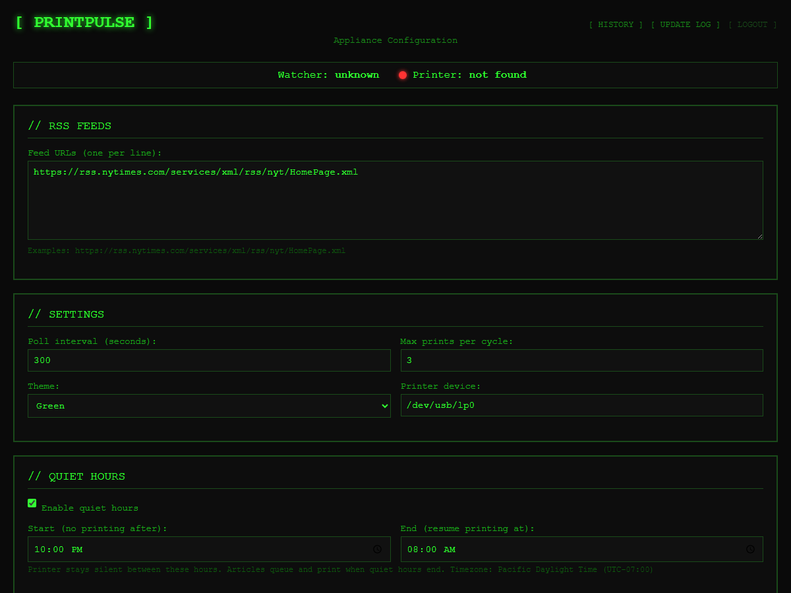
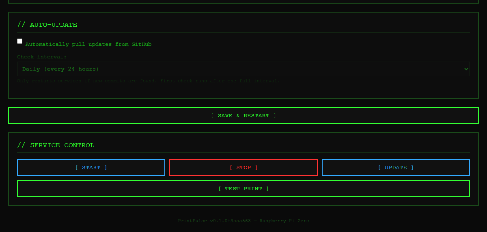
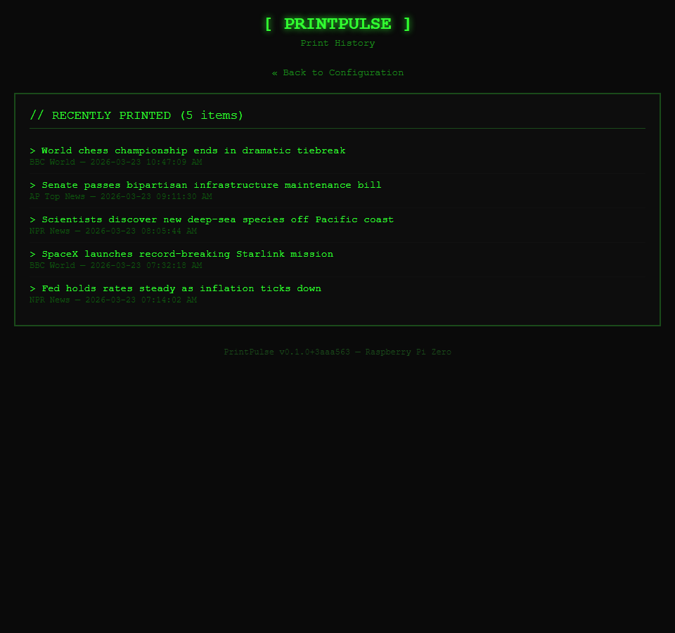

# PrintPulse

**Voice-to-print for AxiDraw pen plotters and thermal printers.**

Dictate a message, type something, or let it monitor a live news feed — PrintPulse renders text in hand-drawn single-stroke vector fonts and sends it to a pen plotter or thermal receipt printer. It's a physical computing project with a retro 80's terminal aesthetic.

There are three ways to build with it:

| Build | What it does |
|-------|-------------|
| 🖊️ **AxiDraw desktop** | Type or speak → pen-plotted output on paper |
| 🧾 **Thermal printer desktop** | RSS feeds → headlines printed on receipt paper |
| 📰 **Pi Zero news appliance** | Always-on headless ticker, configure from your phone |

---

## Web UI (Pi Appliance)

The Pi appliance is configured entirely through a browser-based interface served from the Pi itself — no SSH needed for day-to-day use.

**Configuration** — add RSS feeds, set the poll interval, quiet hours, and auto-update schedule:



**Service control** — start, stop, update the watcher, and send a test print with one click:



**Print history** — see every headline that's been sent to the printer, with source and timestamp:



---

## What You Need

### For AxiDraw plotting

| Item | Notes |
|------|-------|
| **AxiDraw pen plotter** | [AxiDraw V3](https://shop.evilmadscientist.com/productsmenu/846) or any AxiDraw model. ~$475. |
| **Pens** | Felt-tip or ballpoint. Pilot G2, Uni-ball, Staedtler — anything that fits the AxiDraw pen holder. |
| **Paper** | Copy paper works great. |
| **A computer** | Windows, macOS, or Linux with Python 3.9+. |

### For thermal printing

| Item | Notes |
|------|-------|
| **58mm USB thermal printer** | [Travelmate 58mm Thermal Printer](https://www.amazon.com/dp/B08V4H7T47) — ~$35 on Amazon. Any ESC/POS compatible 58mm printer works. |
| **Paper rolls** | 58mm thermal receipt paper. Usually included; replacements are cheap and widely available. |
| **A computer** | Windows, macOS, or Linux with Python 3.9+. |

### For the Pi Zero news appliance (standalone)

Everything above for thermal printing, plus:

| Item | Notes |
|------|-------|
| **Raspberry Pi Zero 2 W** | ~$15. The "W" means Wi-Fi is built in. [Buy here](https://www.raspberrypi.com/products/raspberry-pi-zero-2-w/) |
| **Micro SD card** | 16GB or larger. Any brand. |
| **Micro USB OTG adapter** | Converts the Pi's micro-USB port to a standard USB-A port for the printer. ~$5 on Amazon, search "micro USB OTG adapter". |
| **Power supply** | Micro USB 5V/2.5A. An old phone charger works. |

> The Pi appliance has its own detailed setup guide: **[pi/README.md](pi/README.md)**

---

## Build 1: AxiDraw Desktop Setup

### 1. Install PrintPulse

```bash
git clone https://github.com/jampick/PrintPulse.git
cd PrintPulse
pip install -e .
```

### 2. Install the AxiDraw API

The AxiDraw Python library isn't on PyPI — Evil Mad Scientist distributes it directly.

1. Download the API zip: [AxiDraw API (cdn.evilmadscientist.com)](https://cdn.evilmadscientist.com/dl/ad/public/AxiDraw_API.zip)
2. Extract the zip
3. Open a terminal inside the extracted folder and run:
   ```bash
   pip install .
   ```

### 3. Connect your AxiDraw

Plug the AxiDraw into USB. Load paper and a pen. PrintPulse will home the plotter and start drawing immediately on first run.

### 4. Plot something

```bash
# Type text and send to the AxiDraw
printpulse -i text -t "Hello from the plotter!"

# Record from your microphone (press Enter to stop recording)
printpulse -i mic

# Use a different font
printpulse -i text -t "In the year 2525" -f gothic

# Dry run — renders SVG without touching the hardware
printpulse -i text -t "Test layout" --dry-run
```

---

## Build 2: Thermal Printer Desktop Setup

A great way to print headlines, quotes, or dictated notes on receipt paper — cheap, instant, and oddly satisfying.

### 1. Install PrintPulse

```bash
git clone https://github.com/jampick/PrintPulse.git
cd PrintPulse
pip install -e .
```

**Windows only** — also install the Win32 printing library:

```bash
pip install pywin32
```

### 2. Connect the printer

Plug the USB thermal printer in and turn it on. On **Windows**, it should appear automatically in your device list. On **Linux**, it shows up at `/dev/usb/lp0` — check with:

```bash
ls /dev/usb/lp0
```

### 3. Print something

```bash
# Print a line of text on the thermal printer
printpulse -i text -t "Extra! Extra!" --printer thermal

# Watch a news feed and print new headlines as they appear
printpulse --watch "https://feeds.npr.org/1002/rss.xml" --printer thermal

# Watch multiple feeds, print max 3 stories per cycle
printpulse --watch "https://feeds.npr.org/1002/rss.xml" \
           --watch "http://feeds.bbci.co.uk/news/world/rss.xml" \
           --printer thermal --max-prints 3
```

---

## Build 3: Pi Zero News Appliance

Turn a $15 Pi Zero into a standalone, always-on news ticker. It runs headlessly — no screen, no keyboard needed after setup. Configure everything from your phone's browser.

**You do NOT need**: a monitor, keyboard, mouse, or HDMI cable. Everything is done over Wi-Fi.

### Step 1 — Flash the SD card

1. Download and install **[Raspberry Pi Imager](https://www.raspberrypi.com/software/)** on your computer.
2. Insert your micro SD card.
3. Open Imager and:
   - **Choose OS** → Raspberry Pi OS (other) → **Raspberry Pi OS Lite (32-bit)**
   - **Choose Storage** → select your SD card
4. Click the **gear icon ⚙** (bottom-right) and fill in:
   - ✅ Enable SSH → "Use password authentication"
   - ✅ Set username and password (e.g. username: `pi`, pick a password)
   - ✅ Configure wireless LAN → enter your Wi-Fi name and password
   - ✅ Set locale / timezone
5. Click **Write** and wait ~5 minutes.
6. Put the SD card in the Pi and plug in power. Give it 2–3 minutes to boot and connect to Wi-Fi on first start.

### Step 2 — Find your Pi's IP address

**Option A — Your router**: Log into your router admin page (usually `192.168.1.1`). Look for `raspberrypi` in the device list.

**Option B — Command line** (Windows):
```
ping raspberrypi.local
```
If it responds, the IP is shown. Otherwise try `arp -a` and look for a new device.

**Option C — Fing app**: Free network scanner for your phone. Shows all devices on your Wi-Fi with their IPs.

### Step 3 — SSH into the Pi

Open a terminal (Command Prompt or PowerShell on Windows):

```bash
ssh pi@YOUR_PI_IP
```

Type `yes` when asked about the fingerprint, then enter your password. You'll see:

```
pi@raspberrypi:~ $
```

You're in.

### Step 4 — Run the setup script

One command installs and configures everything:

```bash
git clone https://github.com/jampick/PrintPulse.git
bash PrintPulse/pi/setup.sh
```

This takes about 5–10 minutes on a Pi Zero (slow processor — be patient). It installs Python packages, configures auto-start on boot, and starts the web UI.

When it finishes you'll see something like:

```
╔═════════════════════════════════════════════════════╗
║              SETUP COMPLETE!                       ║
║                                                     ║
║  Web UI:  http://192.168.1.42:5000                  ║
╚═════════════════════════════════════════════════════╝
```

Reboot once to activate printer permissions:

```bash
sudo reboot
```

### Step 5 — Connect the thermal printer

1. Plug the **USB OTG adapter** into the Pi's data USB port (the one closer to the center of the board — NOT the power port).
2. Plug your **thermal printer's USB cable** into the OTG adapter.
3. Power on the printer.

Verify the Pi can see the printer:

```bash
ls /dev/usb/lp0
```

If `/dev/usb/lp0` appears, you're good to go.

### Step 6 — Configure from your phone

1. Open a browser on your phone or laptop.
2. Go to `http://YOUR_PI_IP:5000`.
3. Paste in your RSS feed URLs (one per line) and set your poll interval.
4. Click **[ SAVE & RESTART ]**.

Good starter feeds:

```
https://feeds.npr.org/1002/rss.xml
http://feeds.bbci.co.uk/news/world/rss.xml
https://rsshub.app/apnews/topics/apf-topnews
```

Headlines will start printing as new stories appear. Tear them off the printer like a real wire service terminal.

### Daily use

Once set up you never need to SSH in again:
- The Pi starts automatically on every boot
- Change feeds or settings from `http://YOUR_PI_IP:5000` on any device on your network
- The **Update** button on the web UI pulls the latest code from GitHub and restarts

### Pi troubleshooting

```bash
# Is the watcher running?
sudo systemctl status printpulse

# Watch live logs
sudo journalctl -u printpulse -f

# Printer not showing up?
lsusb               # lists all USB devices
ls -la /dev/usb/    # check for lp0

# Restart everything
sudo systemctl restart printpulse printpulse-web
```

---

## Watch Mode (RSS/Atom Feeds)

Watch mode polls RSS feeds on an interval and prints new stories as they appear. It tracks what's already been printed so you never get duplicates.

```bash
# AP News top stories
printpulse --watch "https://rsshub.app/apnews/topics/apf-topnews"

# BBC World News
printpulse --watch "http://feeds.bbci.co.uk/news/world/rss.xml"

# NPR News
printpulse --watch "https://feeds.npr.org/1002/rss.xml"

# Multiple feeds, print to thermal, poll every 10 minutes
printpulse --watch "https://feeds.npr.org/1002/rss.xml" \
           --watch "http://feeds.bbci.co.uk/news/world/rss.xml" \
           --printer thermal --watch-interval 600

# Quiet hours — suppress printing between 11pm and 7am
# Items found overnight are saved and printed when quiet hours end
printpulse --watch "https://feeds.npr.org/1002/rss.xml" \
           --printer thermal \
           --quiet-start 23:00 --quiet-end 07:00

# Print to both AxiDraw and thermal simultaneously
printpulse --watch "https://rss.nytimes.com/services/xml/rss/nyt/Technology.xml" \
           --printer both
```

Some good free RSS feeds to start with:

| Feed | URL |
|------|-----|
| NPR News | `https://feeds.npr.org/1002/rss.xml` |
| BBC World | `http://feeds.bbci.co.uk/news/world/rss.xml` |
| AP Top News | `https://rsshub.app/apnews/topics/apf-topnews` |
| NY Times Home | `https://rss.nytimes.com/services/xml/rss/nyt/HomePage.xml` |
| Reuters Top News | `https://feeds.reuters.com/reuters/topNews` |

---

## Voice Input

PrintPulse uses [OpenAI Whisper](https://github.com/openai/whisper) for transcription — it runs entirely locally, no internet connection or API key required.

```bash
# Record from mic (press Enter to stop)
printpulse -i mic

# Record for exactly 15 seconds
printpulse -i mic -d 15

# Transcribe an existing audio file
printpulse -i file -a recording.wav
```

On first use, Whisper downloads the model automatically (~150MB for the default `base` model). Larger models are more accurate but slower:

| Model | Size | Speed | Best for |
|-------|------|-------|----------|
| `tiny` | 39M | Fastest | Drafts, quick notes |
| `base` | 74M | Fast | Daily use (default) |
| `small` | 244M | Moderate | Better accuracy |
| `medium` | 769M | Slow | High accuracy |
| `large` | 1.5B | Slowest | Best accuracy |

```bash
# Use a larger model
printpulse -i mic -m small
```

---

## Fonts

PrintPulse uses [Hershey fonts](https://en.wikipedia.org/wiki/Hershey_fonts) — single-stroke vector fonts originally designed for CNC and pen plotters. Each letter is drawn as continuous pen strokes, not filled outlines.

```bash
printpulse -i text -t "Hello" -f cursive
printpulse -i text -t "Hello" -f gothic
printpulse -i text -t "Hello" -f block
```

| Friendly Name | Style |
|--------------|-------|
| `block` | Clean architectural lettering (default) |
| `cursive` | Flowing handwriting |
| `script-bold` | Heavy calligraphic |
| `roman` | Classic serif |
| `typewriter` | Monospaced feel |
| `times` | Serif body text |
| `gothic` | Old English blackletter |
| `italic` | Sans-serif italic |

---

## Letter & Journal Modes

### Letter mode

Formats text as a formal letter with a decorative header:

```bash
# Write a letter from a text file
printpulse -i text -t letter.txt --letter

# Compose interactively
printpulse --letter-template

# Use a stationery profile
printpulse -i text -t letter.txt --letter --stationery victorian
```

### Journal mode

Adds a timestamp and tracks your position across pages:

```bash
# Voice journal entry
printpulse -i mic --journal

# Text entry
printpulse -i text -t "Finished the prototype today." --journal
```

---

## Output Options

```bash
# Dry run — renders SVG and shows a preview without printing
printpulse -i text -t "Test" --dry-run

# Send to thermal printer instead of AxiDraw
printpulse -i text -t "Breaking news" --printer thermal

# Send to both
printpulse -i text -t "Hello" --printer both

# Skip all confirmation prompts (useful in scripts)
printpulse -i text -t "Quick print" -y

# Save the generated SVG to a file
printpulse -i text -t "Hello" -o output.svg

# Portrait orientation (AxiDraw default is landscape)
printpulse -i text -t "Hello" --portrait

# Amber terminal theme instead of green
printpulse -i text -t "Hello" --theme amber
```

---

## CLI Reference

```
printpulse [-h] [-i {mic,file,text}] [-a AUDIO_FILE] [-t TEXT]
           [-d DURATION] [-f FONT] [--font-size POINTS]
           [--page {letter,a4,a3}] [--portrait] [-o OUTPUT]
           [--preview | --no-preview] [--dry-run] [-y]
           [-m {tiny,base,small,medium,large}]
           [--theme {green,amber}]
           [--journal] [--journal-reset]
           [--watch URL [URL ...]] [--watch-interval SECONDS]
           [--max-prints N] [--quiet-start HH:MM] [--quiet-end HH:MM]
           [--printer {axidraw,thermal,both}]
           [--letter] [--letter-template]
           [--stationery PROFILE] [--list-stationery]
```

---

## Configuration

User config and state files live in your home directory:

```
~/.printpulse_seen.json        # Tracks which RSS items have been printed
~/.printpulse_history.json     # Print history log
~/.printpulse_retry.json       # Retry queue for failed prints
~/.printpulse_quiet_queue.json # Items saved during quiet hours
~/.printpulse/
  config.json                  # Global settings and defaults
  stationery/                  # Custom stationery profiles (JSON)
```

### Custom stationery

Drop JSON files in `~/.printpulse/stationery/` to define your own letterhead:

```json
{
  "name": "myheader",
  "header": {
    "prefix": "FROM THE DESK OF",
    "name": "Your Name",
    "title": "Your Title",
    "font": "scripts",
    "font_size": 20.0,
    "frame_style": "ornamental"
  },
  "body_font": "futural",
  "body_font_size": 12.0
}
```

---

## Architecture

```
printpulse/
  app.py           CLI orchestrator & argparse
  config.py        Config dataclass, font map, page presets
  ui.py            Retro terminal UI (Rich library)
  speech.py        Microphone recording & Whisper transcription
  text_to_svg.py   Hershey font rendering & SVG generation
  plotter.py       AxiDraw control (pyaxidraw)
  thermal.py       ESC/POS thermal printer output
  watch.py         RSS/Atom feed polling, quiet hours, retry queue
  letter.py        Letter document model
  journal.py       Timestamped journal entries
  illustrations.py AI illustration pipeline (DALL-E + vtracer)

pi/
  webapp/          Flask web UI for the Pi appliance
  setup.sh         One-command Pi setup script
  appliance.py     Pi-specific config and entry point
```

---

## Requirements

- Python 3.9+
- Windows, macOS, or Linux
- AxiDraw pen plotter (optional — use `--dry-run` without hardware)
- ESC/POS thermal printer (optional)
- Microphone (optional — for voice input)

---

## License

GNU General Public License v3.0 — see [LICENSE](LICENSE) for details.
